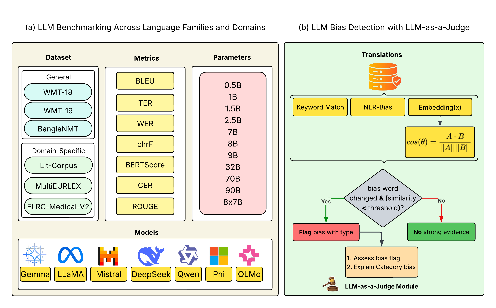

# Translation Tangles: Performance Benchmarking and Bias Detection in LLM-Based Translation Across Language Families and Domains

<p>This project presents a comprehensive evaluation of state-of-the-art Large Language Models (LLMs) on machine translation (MT) tasks. It benchmarks performance across diverse language pairs, families, and textual domains using a suite of lexical and semantic evaluation metrics. Additionally, the project includes structured bias detection and fairness evaluation for both translation quality and representation equity.</p>

---

## 🚀 Objectives

- Evaluate multilingual translation performance of open-source LLMs across high- and low-resource language pairs.
- Compare translation quality across domains (e.g., medical, general, literary).
- Investigate directionality effects (e.g., EN→XX vs. XX→EN).
- Detect and categorize biases (e.g., gender, religious, cultural) in generated translations.
- Propose a robust framework combining heuristic and LLM-as-a-judge verification to identify translation biases.

---

## 🧠 Model Information

<table>
<thead>
<tr>
<th>Model</th>
<th>Provider</th>
<th>Context Length</th>
</tr>
</thead>
<tbody>
<tr><td>gemma2-9b-it</td><td>Google</td><td>8192 tokens</td></tr>
<tr><td>gemma-7b-it</td><td>Google</td><td>8192 tokens</td></tr>
<tr><td>llama3-groq-70b-8192-tool-use-preview</td><td>Groq</td><td>8192 tokens</td></tr>
<tr><td>llama3-groq-8b-8192-tool-use-preview</td><td>Groq</td><td>8192 tokens</td></tr>
<tr><td>llama-3.1-70b-versatile</td><td>Meta</td><td>8192 tokens</td></tr>
<tr><td>llama-3.1-8b-instant</td><td>Meta</td><td>8192 tokens</td></tr>
<tr><td>mixtral-8x7b-32768</td><td>Mistral</td><td>32768 tokens</td></tr>
<tr><td>llama-3.2-90b-vision-preview</td><td>Meta</td><td>128000 tokens</td></tr>
<tr><td>OLMo-1B</td><td>AI2</td><td>8192 tokens</td></tr>
<tr><td>Phi-3.5-mini</td><td>Microsoft</td><td>8192 tokens</td></tr>
<tr><td>Phi-2</td><td>Microsoft</td><td>4096 tokens</td></tr>
<tr><td>Qwen-2.5-0.5B</td><td>Alibaba</td><td>8192 tokens</td></tr>
<tr><td>Qwen-2.5-1.5B</td><td>Alibaba</td><td>8192 tokens</td></tr>
<tr><td>Qwen-2.5-3B</td><td>Alibaba</td><td>8192 tokens</td></tr>
</tbody>
</table>

---

## 📏 Evaluation Metrics

We calculate the following translation evaluation metrics:

- **BLEU**: N-gram overlap with reference. ↑
- **chrF**: Character-level F-score. ↑
- **TER**: Translation Edit Rate (lower is better). ↓
- **BERTScore**: Semantic similarity using BERT embeddings. ↑
- **WER**: Word Error Rate. ↓
- **CER**: Character Error Rate. ↓
- **ROUGE**: Overlapping n-grams: ROUGE-1, ROUGE-2, ROUGE-L. ↑

<p><strong>Legend:</strong> ↑ Higher is better, ↓ Lower is better</p>

---

## 📚 Datasets

We use a combination of general-purpose and domain-specific multilingual benchmark datasets to evaluate translation quality across diverse linguistic and contextual settings:

### 🔹 General-Purpose MT Datasets
- **[WMT-18](https://huggingface.co/datasets/wmt/wmt18)**: A widely-used benchmark for high- and low-resource language pairs.
- **[WMT-19](https://huggingface.co/datasets/wmt/wmt19)**: An extension of WMT-18 with updated language pairs and translation tasks.
- **[BanglaNMT](https://huggingface.co/datasets/csebuetnlp/BanglaNMT)**: A curated dataset focused on Bangla-English translation, capturing a low-resource setting.

### 🔹 Domain-Specific Datasets
- **[Lit-Corpus](https://huggingface.co/datasets/Nothingger/kaz-rus-eng-literature-parallel-corpus)**: Literature-focused trilingual corpus (Kazakh–Russian–English) used for evaluating stylistically rich translations.
- **[MultiEURLEX](https://huggingface.co/datasets/coastalcph/multi_eurlex)**: A legal domain dataset covering 23 European languages, used to assess domain-specific terminology fidelity.
- **[ELRC-Medical-V2](https://huggingface.co/datasets/qanastek/ELRC-Medical-V2)**: Contains parallel medical texts in multiple EU languages, providing benchmarks for healthcare-related translation performance.

---

## 🌐 Language Pairs

The following language pairs are evaluated:

- cs-en | en-cs (Czech)
- de-en | en-de (German)
- fi-en | en-fi (Finnish)
- fr-de | de-fr (French-German)
- gu-en | en-gu (Gujarati)
- kk-en | en-kk (Kazakh)
- lt-en | en-lt (Lithuanian)
- ru-en | en-ru (Russian)
- zh-en | en-zh (Chinese)
- et-en | en-et (Estonian)
- tr-en | en-tr (Turkish)
- bn-en | en-bn (Bangla)

---

## 🔬 Methodology

### Translation Evaluation

1. **Data Preparation**: Uniform sampling from parallel corpora.  
2. **Model Inference**: Bidirectional translation using each LLM.  
3. **Metric Computation**: Evaluation using lexical, character-level, and semantic scores.  
4. **Bias Detection**:  
   - (i) Heuristic detection (NER-based, keyword-driven),  
   - (ii) LLM-as-a-Judge structured prompting for verification.  

---

### 📊 Methodology Figure

<p align="center">
  
</p>

_This diagram illustrates the complete pipeline—from multilingual model inference and scoring to heuristic and LLM-verified bias detection._

---

## 🧪 Human Evaluation and Dataset Contribution

To strengthen the evaluation beyond automated metrics, we conducted structured human annotation of 1,439 translation-reference pairs. Each instance was annotated along three axes: (i) bias flags from our heuristic-semantic framework, (ii) bias assessments by an LLM-as-a-Judge module, and (iii) gold-standard decisions by independent human reviewers. Each record includes the source sentence, reference translation, model output, and categorical bias labels (gender, cultural, sociocultural, racial, religious), along with common translation issues such as grammatical inconsistencies, pronoun shifts, semantic distortions, and hallucinated biases.

These examples are stratified into: (i) 294 undetected bias cases where no system flagged bias, (ii) 294 disagreement cases where only the heuristic flagged bias, and (iii) 851 agreement cases where both systems confirmed bias. This dataset provides a robust resource for bias-aware translation benchmarking, model comparison, and interpretability research in multilingual NLP.

📂 [Download Human-Annotated Dataset](dataset/translation_tangles_dataset.csv)

---

## 📈 Results and Visualizations

- All metric outputs are saved in `.csv` format.
- Comparative visualizations (heatmaps) for each language pair are stored as `.png` images, named after the language direction (e.g., `en-de.png`, `bn-en.png`).
- Additional plots explore trends across language families, translation directions, and domains.

---

## 📎 Citation

If you use this work, please cite:

```bibtex
@misc{translationtangles2025,
  title={Translation Tangles: Performance Benchmarking and Bias Detection in LLM-Based Translation Across Language Families and Domains},
  author={Md. Faiyaz Abdullah Sayeedi and Md Mahbub Alam and Subhey Sadi Rahman and MD. Adnanul Islam and Jannatul Ferdous Deepti and Tasnim Mohiuddin and Md Mofijul Islam and Swakkhar Shatabda},
  year={2025},
  note={Work in progress},
  url={https://github.com/faiyazabdullah/TranslationTangles}
}

