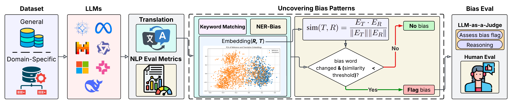

# _Ready to Translate, Not to Represent?_ Bias and Performance Gaps in Multilingual LLMs Across Language Families and Domains

_**Abstract:** The rise of Large Language Models (LLMs) has redefined Machine Translation (MT), enabling context-aware and fluent translations across hundreds of languages and textual domains. Despite their remarkable capabilities, LLMs often exhibit uneven performance across language families and specialized domains. Moreover, recent evidence reveals that these models can encode and amplify different biases present in their training data, posing serious concerns for fairness, especially in low-resource languages. To address these gaps, we introduce Translation Tangles, a unified framework and dataset for evaluating the translation quality and fairness of open-source LLMs. Our approach benchmarks 24 bidirectional language pairs across multiple domains using different metrics. We further propose a hybrid bias detection pipeline that integrates rule-based heuristics, semantic similarity filtering, and LLM-based validation. We also introduce a high-quality, bias-annotated dataset based on human evaluations of 1,439 translation-reference pairs._

  

Fig: Our framework comprises two key components: **(a)** LLM Benchmarking, where _T_ are evaluated against _R_ using LLMs across diverse language families and domains; and **(b)** Uncovering Bias Pattern with LLM-as-a-Judge Evaluation, where potential biases are flagged using linguistic heuristics and semantic analysis, and then verified through LLMs and human annotators. Here, _S_ = Source, _R_ = Reference, _T_ = Translation.

## 🧠 Models

<table>
<thead>
<tr>
<th>Model</th>
<th>Provider</th>
<th>Context Length</th>
</tr>
</thead>
<tbody>
<tr><td>gemma2-9b</td><td>Google</td><td>8192 tokens</td></tr>
<tr><td>gemma-7b</td><td>Google</td><td>8192 tokens</td></tr>
<tr><td>llama-3-70b</td><td>Meta</td><td>8192 tokens</td></tr>
<tr><td>llama-3-8b</td><td>Meta</td><td>8192 tokens</td></tr>
<tr><td>llama-3.1-70b</td><td>Meta</td><td>8192 tokens</td></tr>
<tr><td>llama-3.1-8b</td><td>Meta</td><td>8192 tokens</td></tr>
<tr><td>llama-3.2-90b-vision</td><td>Meta</td><td>128000 tokens</td></tr>
<tr><td>mixtral-8x7b</td><td>Mistral</td><td>32768 tokens</td></tr>
<tr><td>OLMo-1B</td><td>AI2</td><td>8192 tokens</td></tr>
<tr><td>Phi-3.5-mini</td><td>Microsoft</td><td>8192 tokens</td></tr>
<tr><td>Phi-2</td><td>Microsoft</td><td>4096 tokens</td></tr>
<tr><td>Qwen-2.5-0.5B</td><td>Alibaba</td><td>8192 tokens</td></tr>
<tr><td>Qwen-2.5-1.5B</td><td>Alibaba</td><td>8192 tokens</td></tr>
<tr><td>Qwen-2.5-3B</td><td>Alibaba</td><td>8192 tokens</td></tr>
</tbody>
</table>

## 📏 Evaluation Metrics

| Metric       | Description                                         | Direction |
|--------------|-----------------------------------------------------|-----------|
| **BLEU**     | N-gram overlap with reference                       | ↑  |
| **chrF**     | Character-level F-score                             | ↑  |
| **TER**      | Translation Edit Rate                               | ↓  |
| **BERTScore**| Semantic similarity using BERT embeddings           | ↑  |
| **WER**      | Word Error Rate                                     | ↓  |
| **CER**      | Character Error Rate                                | ↓  |
| **ROUGE**    | Overlapping n-grams: ROUGE-1, ROUGE-2, ROUGE-L      | ↑  |

<strong>Legend:</strong> ↑ Higher is better, ↓ Lower is better

## 📚 Translation Performance Evaluation Datasets

We use a combination of general-purpose and domain-specific multilingual benchmark datasets to evaluate translation quality across diverse linguistic and contextual settings:

| Dataset        | Languages                | Size         | Domain       | Fields                                                                 | Splits                                |
|----------------|--------------------------|--------------|--------------|------------------------------------------------------------------------|----------------------------------------|
| [**ELRCMedical**](https://huggingface.co/datasets/qanastek/ELRC-Medical-V2) | English + 21 EU languages | 100K–1M      | Medical      | `doc_id`, `lang`, `source_text`, `target_text`                         | None (manual)                          |
| [**MultiEURLEX**](https://huggingface.co/datasets/coastalcph/multi_eurlex)     | 23 EU languages         | 65K docs     | Legal        | `doc_id`, `text`, `labels`                                             | Train (55K), Dev/Test (5K each)        |
| [**Lit-Corpus**](https://huggingface.co/datasets/Nothingger/kaz-rus-eng-literature-parallel-corpus)      | Kazakh, Russian, English | 71K pairs    | Literature   | `source_text`, `target_text`, `X_lang`, `y_lang`                       | None                                   |
| [**BanglaNMT**](https://huggingface.co/datasets/csebuetnlp/BanglaNMT)       | Bangla, English         | 2.38M pairs  | General      | `bn`, `en`                                                             | Train (2.38M), Val (597), Test (1K)    |
| [**WMT-19**](https://huggingface.co/datasets/wmt/wmt19)          | Multilingual            | 100M–1B      | General      | `source_text`, `target_text`, `X_lang`, `y_lang`                       | Train, Val                             |
| [**WMT-18**](https://huggingface.co/datasets/wmt/wmt18)          | Multilingual            | 100M–1B      | General      | `source_text`, `target_text`, `X_lang`, `y_lang`                       | Train, Val, Test                       |

## 🌐 Language Pairs

| Code Pair     | Language Names            |
|---------------|---------------------------|
| cs-en / en-cs | Czech ↔ English            |
| de-en / en-de | German ↔ English           |
| fi-en / en-fi | Finnish ↔ English          |
| fr-de / de-fr | French ↔ German            |
| gu-en / en-gu | Gujarati ↔ English         |
| kk-en / en-kk | Kazakh ↔ English           |
| lt-en / en-lt | Lithuanian ↔ English       |
| ru-en / en-ru | Russian ↔ English          |
| zh-en / en-zh | Chinese ↔ English          |
| et-en / en-et | Estonian ↔ English         |
| tr-en / en-tr | Turkish ↔ English          |
| bn-en / en-bn | Bangla ↔ English           |

## 🧪 Human Evaluation and Our Dataset Contribution

To strengthen the evaluation beyond automated metrics, we conducted structured human annotation of 1,439 translation-reference pairs. Each instance was annotated along three axes: (i) bias flags from our heuristic-semantic framework, (ii) bias assessments by an LLM-as-a-Judge module, and (iii) gold-standard decisions by independent human reviewers. Each record includes the source sentence, reference translation, model output, and categorical bias labels (gender, cultural, sociocultural, racial, religious), along with common translation issues such as grammatical inconsistencies, pronoun shifts, semantic distortions, and hallucinated biases.

These examples are stratified into: (i) 294 undetected bias cases where no system flagged bias, (ii) 294 disagreement cases where only the heuristic flagged bias, and (iii) 851 agreement cases where both systems confirmed bias. This dataset provides a robust resource for bias-aware translation benchmarking, model comparison, and interpretability research in multilingual NLP.

📂 [Download Human-Annotated Dataset](dataset/translation_tangles_dataset.csv)
